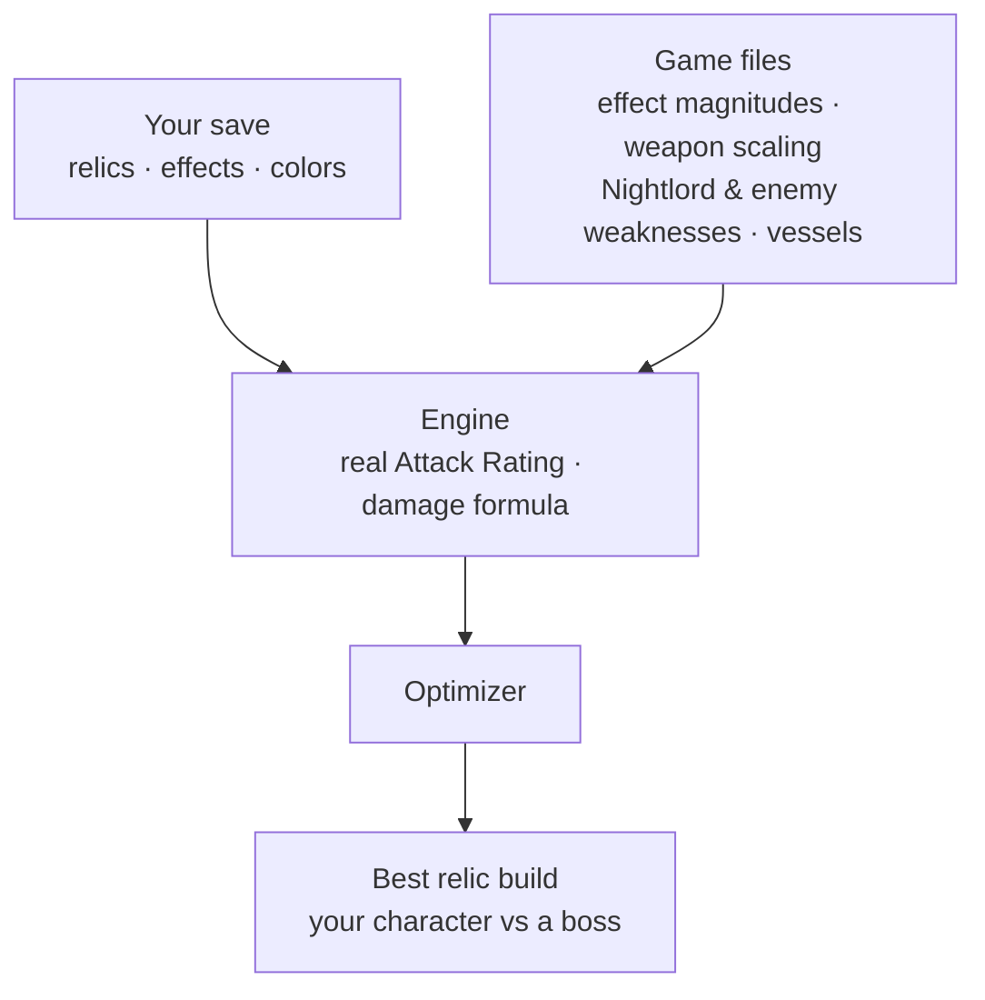

# EvilNightreign

> If you too want to beat **Evil Nightreign** and you're drowning in relics, I built this to do exactly that.

A relic build optimizer for Elden Ring Nightreign. It reads your save (your actual relics) and the game's own data, computes **real** attack ratings and damage, and finds the best relic combination for a given character and boss.

## Why

Nightreign hands you hundreds — thousands — of relics with cryptic effects, and no in-game way to compare builds. So instead of reading every description, this project extracts the truth straight from the game: exact effect magnitudes, weapon scaling, and every Nightlord's real elemental and status weaknesses. Then it does the math for you.

## Quickstart

The project uses [`uv`](https://docs.astral.sh/uv/) — it creates the venv and installs everything on its own:

```bash
uv run nr setup                     # copy regulation.bin (+ save) into inputs/
uv run nr data                      # (re)generate data/ (relics, params, weapons, rosters) — ~6s
uv run nr demo pipeline             # demo: Duchess + weapon + relics -> damage vs the Nightlords
uv run nr optimize duchess caligo   # (coming) best relics for this build
uv run pytest                       # validation (AR vs real in-game readings)
```

Regenerate a single step: `uv run nr data {relics|params|weapons|nightlords|npcs|vessels}`.

> [!NOTE]
> You bring your own game files. `nr setup` auto-detects `regulation.bin` from common Steam locations — or pass yours: `nr setup "/path/to/ELDEN RING NIGHTREIGN/Game"`. Then drop your `NR0000.sl2` save into `inputs/`. Nothing is redistributed here.

> [!TIP]
> `alias nr='uv run nr'`, then just type `nr data`.

## How it works



## Structure

```text
nightreign/          the package
├── io/              read raw files (regulation.bin, save, paramdef)
├── engine/          the engine: weapon AR, damage formula, relic effects
├── optimize/        the optimizer (coming)
├── datagen/         extraction logic (called by the CLI)
├── resources/       constants, Nightlord mapping, name tables
└── cli.py           the `nr` entry point

inputs/              local working copies of game files (gitignored)
data/raw/            big regenerable intermediates (gitignored)
data/curated/        small deliverables (relics, rosters, vessels) — committed
examples/            demos      tests/  validation (AR vs in-game readings)
```

## Validation

The AR formula is checked against real in-game readings (Duchess, levels 1-15): `uv run pytest`.

---

*Built for personal use, read-only, no cheating online — just min-maxing my own runs.*
